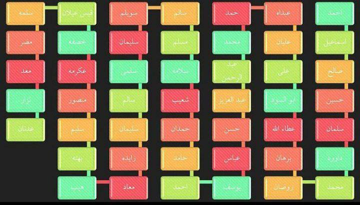
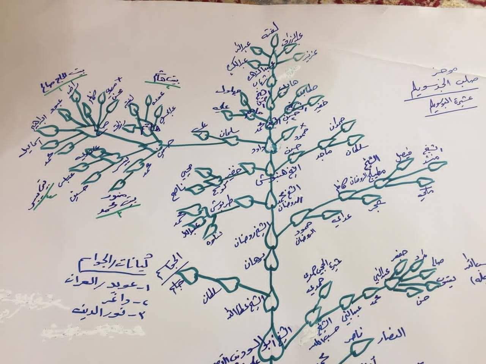
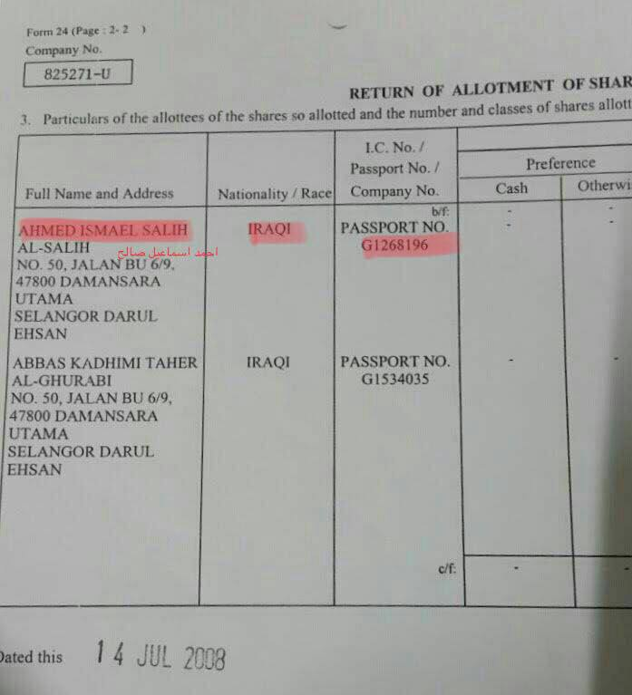
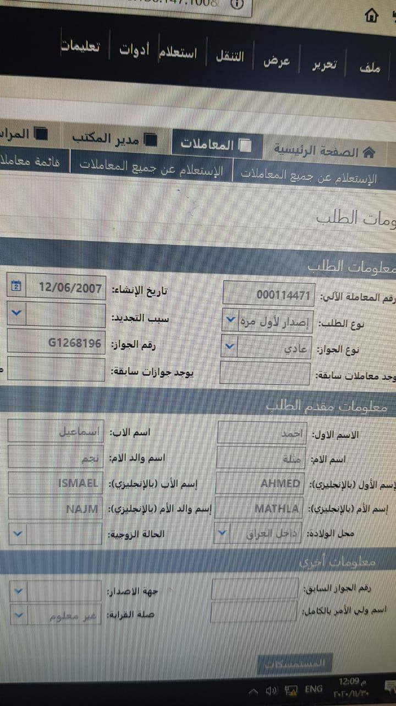
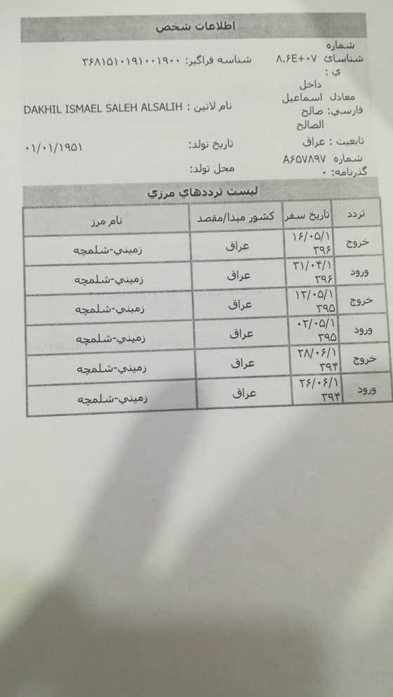

---
---

# النسب

**أحمد بن إسماعيل** بن صالح بن حسين بن سلمان بن داود بن حمبوش
*(الذي هو جد أحمد إسماعيل واسم قبيلتهم)* بن محمد بن روضان بن برهان بن عطاء الله بن
أبو السعود بن علي بن عليان *(وهو معروف جدًا)* بن عبده بن حمد بن
محمد بن عبد الرحمن بن عبد العزيز بن حسن بن عباس بن يوسف بن أحمد بن حامد بن حمدان بن شعيب بن
سلامة بن مسلم بن سالم بن سويلم *(قبيلة آل أبو سليم سُمّيت باسمه)* بن سليمان بن سلام بن سالم بن سليمان بن زايدة بن معاذ بن هائب بن بهتة بن سالم بن منصور
بن عكرمة بن خصمة بن قيس بن عيدان بن سلامة بن مقصر بن معد بن نزار بن عدنان.

لا يصل نسبه إلى النبي محمد *(صلى الله عليه وآله وسلم)*، ولذلك فهو **ليس** سيدًا.

التالي هو شجرة العائلة التي شاركها ابن عمه:

<video controls width="100%">
  <source src="../../../public/videos/family-tree.mp4" type="video/mp4" />
  متصفحك لا يدعم تشغيل الفيديو.
</video>

# الوثائق الرسمية
لا يوجد أي إشارة إلى كونه سيدًا في الوثائق الرسمية الصادرة عن الحكومة.

هذه المعلومات موجودة في نموذج جواز سفره (حصلنا عليها من شخص لديه صلاحية حكومية).

أخوه **دخيل إسماعيل صالح** سافر إلى إيران ثلاث مرات بين عامي 2013 و2015،
ولا يتضمن اسمه في جواز السفر كلمة "سيد" أيضًا.

# الأقارب
