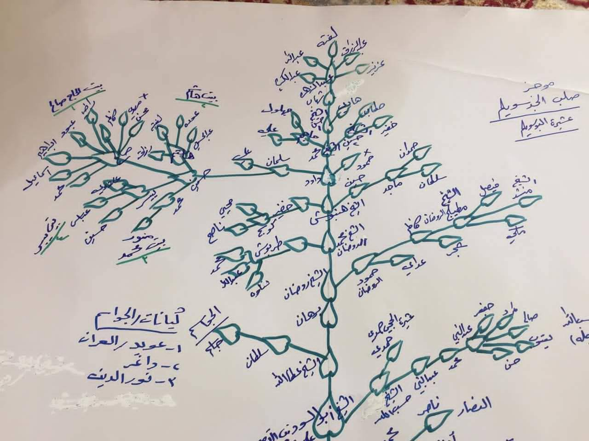
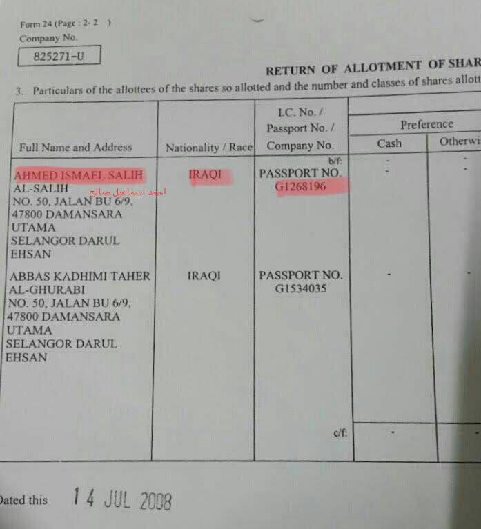
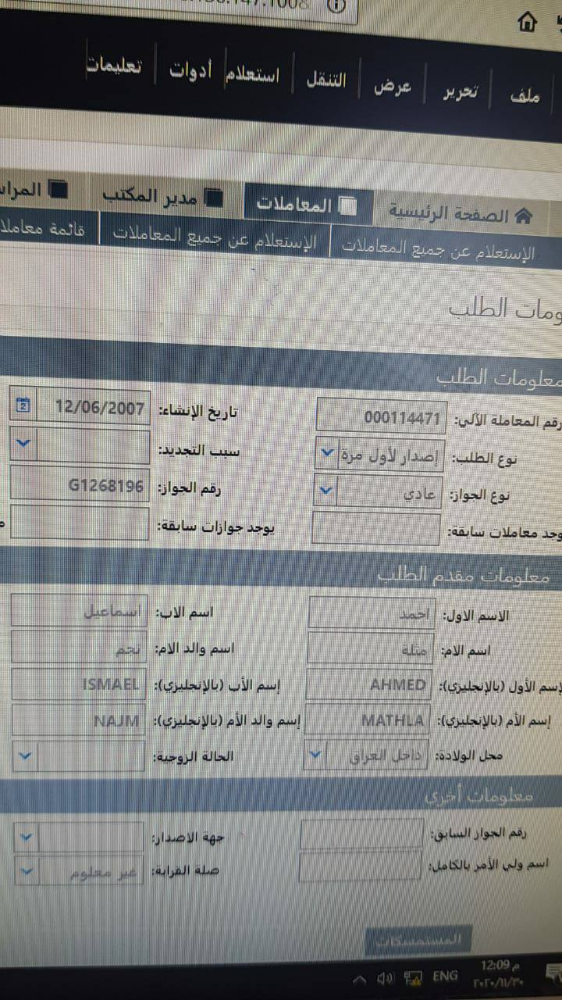
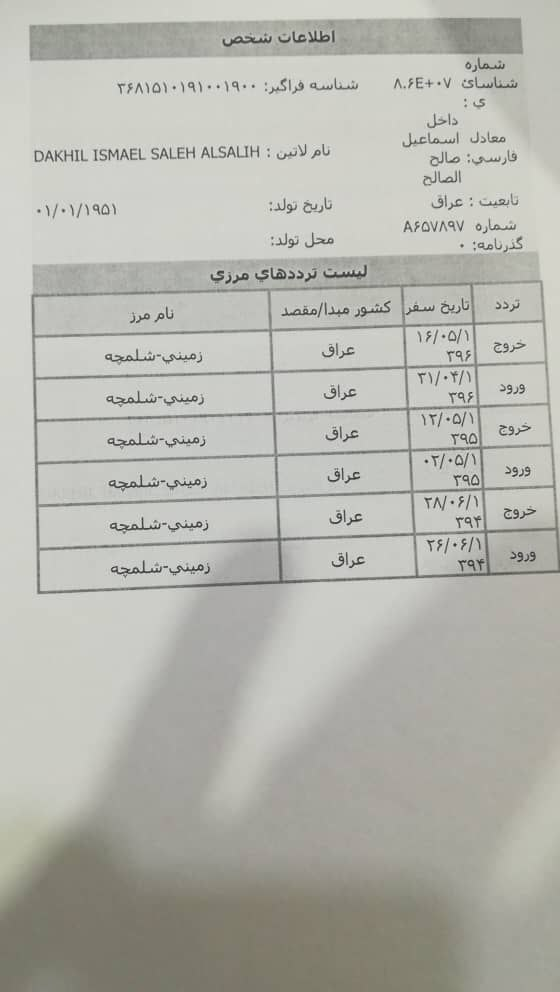

---
---

# Genealogy

**Ahmed bin Ismail** bin Saleh bin Hussein bin Salman bin Dawood bin Hamboush
*(who is the grandfather of Ahmed Ismail and name of their tribe)* bin Muhammad bin Rawdan bin Burhan bin Atta Allah bin
Abu Al-Soud bin Ali bin Alyan *(he is very well known)* bin Abdah bin Hamad bin
Muhammad bin Abdul Rahman bin Abdul Aziz bin Hassan bin Abbas bin Youssef bin Ahmed bin Hamed bin Hamdan bin Shuaib bin
Salamah bin Muslim bin Salem bin Suwailem *(The tribe of Al Abu Sulaym is named
after him)* bin Suleiman bin Salam bin Salem bin Suleiman bin Zaida bin Muad bin Haib bin Bahta bin Salim bin Mansour
bin Ikrimah bin Khasma bin Qais bin Eidan bin Salamah bin Muqsar bin Maad bin Nizar bin Adnan

His ancestor does not reach the Prophet of Islam *(peace be upon him and his family)*, hence he is **not** Seyed.

Following is the family tree that his cousin has shared:

<video controls width="100%">
  <source src="../../public/videos/family-tree.mp4" type="video/mp4" />
  Your browser does not support the video tag.
</video>

# Official Documents
There is no sign of being Seyed in his official government issued documents

These information are in his passport form (we got it from someone who had governmental access)

His brother **Dakhil Ismael Saleh** has traveled to Iran three times between 2013 and 2015,
and his passport name doesn't include the word Seyed either.

# Relatives

